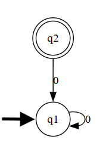
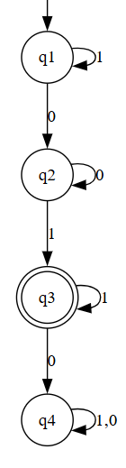
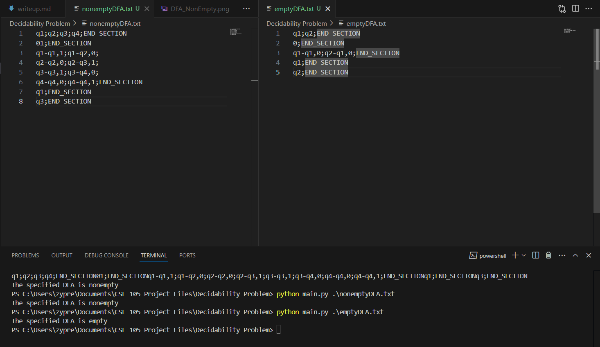

# Computational Problem

In this project, I intend to construct a program that decides the DFA emptiness problem.

# Program Documentation

## String Encoding Spec

We define a valid string as the following:

A string should consist of 5 sections:

1. A list of semicolon separated unique strings indicating state names.
2. A string of unique ASCII characters indicating the alphabet. The end is marked with a semicolon.
3. A list of semicolon separated list transition definitions, formatted as such: `<from_state>-<to_state>,<input>;`
4. A single string from the set of defined state names.
5. A list of semicolon separated strings from the defined states in item 1. Repeats are ignored.

Each of these sections are separated by the string `END_SECTION`, which is a reserved word and cannot be used as a state name.

Note that on top of the reserved word `END_SECTION`, the symbol `;` also cannot be used in state names or the alphabet. Note that all whitespaces are ignored, so a defining a state as `state name;` will be interpreted as `statename;`

Thus an example string would look like such:
```
q1;
q2;
END_SECTION
abc;
END_SECTION
q1-q2,a;
q1-q1,b;
q1-q2,c;
q2-q1,a;
q2-q2,b;
q2-q2,c;
END_SECTION
q1;
END_SECTION
q2;
END_SECTION
```

# Example Strings

## Example in the Set of Empty DFAs

```
q1;q2;END_SECTION
0;END_SECTION
q1-q1,0;q2-q1,0;END_SECTION
q1;END_SECTION
q2;END_SECTION
```



There is no way to reach the accept state `q2` from the start state `q1`, so we know that this DFA must recognize the empty set.
 
## Example not in the Set of Empty DFAs

```
q1;q2;q3;q4;END_SECTION
01;END_SECTION
q1-q1,1;q1-q2,0;
q2-q2,0;q2-q3,1;
q3-q3,1;q3-q4,0;
q4-q4,0;q4-q4,1;END_SECTION
q1;END_SECTION
q3;END_SECTION
```



This DFA recognizes the language defined by the Regular Expression: `1*0+1+`. One example of a string accepted is "01". Thus it is not in the Set E_DFA.

# Source Code

## Screenshot Example of Running Script

To test the code yourself, simply install main.py, and create a .txt file describing a valid DFA. 



```
import sys
import re

class Lexer:
    def __init__(self, string):
        self.string = string.replace('\n','').replace('\r','').replace(' ', '')
        self.line = 0
        self.index = 0
    
    def readToken(self):
        startIndex = self.index
        while (not self.atEnd() and self.next() != ";" and self.string[startIndex:self.index+1] != "END_SECTION"):
            self.index = self.index + 1
        out = self.string[startIndex:self.index + 1]
        if out == "END_SECTION":
            self.index = self.index + 1
        else:
            self.index = self.index + 2
        if (self.atEnd() and not out == "END_SECTION"): return "EOF"
        return out

    def atEnd(self):
        return self.index + 1 >= len(self.string)

    def next(self):
        if not self.atEnd():
            return self.string[self.index + 1]
        else:
            return "EOF"

    def run(self):
        token = self.readToken()
        out = []
        while (token != "EOF"):
            out.append(token)
            token = self.readToken()
        return out

def run(file):
    lex = Lexer(file.read())
    tokens = lex.run()
    state = 1
    definedStates = set()
    stateTransitions = {}
    alphabet = set()
    start = ""
    acceptStates = set()
    for token in tokens:
        if (token == "END_SECTION"): 
            state = state + 1
            continue
        match state:
            case 1: # defining states
                definedStates.add(token)
                stateTransitions[token] = {}
            case 2: # defining alphabet
                alphabet = set(token)
            case 3: # defining state transitions
                transition = re.split('-|,', token)
                if (len(transition) != 3):
                    raise Exception("Error! Transition token had incorrect format "+ token)
                else:
                    if transition[0] in definedStates and transition[1] in definedStates and transition[2] in alphabet:
                        stateTransitions[transition[0]][transition[2]] = transition[1]
                    else:
                        raise Exception("Error! Transition token tried to specify a transition using an undefined state or invalid input character")
            case 4: # defining start state
                if len(start) != 0:
                    raise Exception("Error! More than one start state defined")
                    continue
                start = token
            case 5: # defining accept states
                if (token in definedStates):
                    acceptStates.add(token)
                else:
                    raise Exception("Error! Specified accept state " + token + " is not defined!")
    for state in stateTransitions:
        if len(stateTransitions[state].keys()) != len(alphabet):
            raise Exception("Error! not enough transitions defined for state " + state)
    return (definedStates, alphabet, stateTransitions, start, acceptStates)


def isEmpty(dfa):
    (definedStates, alphabet, stateTransitions, start, acceptStates) = dfa
    explored = set()
    unexplored = [start]
    while len(unexplored) > 0:
        currState = unexplored.pop()
        explored.add(currState)
        for key in stateTransitions[currState]:
            if stateTransitions[currState][key] not in explored:
                unexplored.append(stateTransitions[currState][key])
    
    intersection = acceptStates.intersection(explored)

    return len(intersection) == 0

def main():
    if len(sys.argv) != 2:
       print("Invalid Number of Arguments " + str(len(sys.argv)) + " received, 2 expected.")
       return
    filename = sys.argv[1]
    try:
        with open(filename, "r") as file:
            dfa = run(file)
            if isEmpty(dfa):
                print("The specified DFA is empty")
            else:
                print("The specified DFA is nonempty")
    except FileNotFoundError:
        print("Specified file not found.")
    except Exception as e:
        print("Program failed with error: \"" + str(e) + "\"")

main()
```