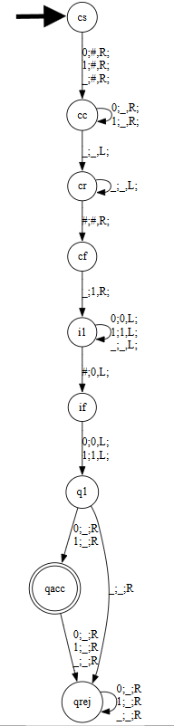

# Mapping Reduction Problem

I will be creating an implementation of a Mapping Reduction from A_TM to HALT_TM.

# Program Documentation

## String Encoding Spec

We define a valid input string as the following:

A string should consist of 8 sections:

1. A list of semicolon separated unique strings indicating state names.
2. A string of unique ASCII characters indicating the alphabet. The end is marked with a semicolon.
3. A string of unique ASCII characters indicating the tape alphabet. The end is marked with a semicolon.
4. A list of semicolon separated list transition definitions, formatted as such: `<from_state>,<tape-read>-<to_state>,<tape-write>,<L/R>;`
5. A single string from the set of defined state names, defined as the start state.
6. A single string from the set of defined state names, defined as the accept state.
7. A single string from the set of defined state names, defined as the reject state.
8. The input string intended to be simulated with the defined Turing Machine.

In item 4 of the list, all transitions need to be explicitly stated.

Each of these sections are separated by the string `END_SECTION`, which is a reserved word and cannot be used as a state name.

Note that on top of the reserved word `END_SECTION`, the symbol `;` also cannot be used in state names or the alphabet. Note that all whitespaces are ignored, so a defining a state as `state name;` will be interpreted as `statename;`.

On top of this, state names cannot start with the prefix `internal`. This is to avoid conflicts with the new states we will create. For transitions, we will interpret the character `_` as the empty read. The program also requires that the tape alphabet of any input Turing machine cannot include `#`. It should be easy to remap the conflicting variables when necessary.

Thus an example string would look like such:
```
q1;
qacc;
qrej;
END_SECTION
a;
END_SECTION
a_;
END_SECTION
q1,_-qacc,a,L;
q1,a-q1,a,L;
qacc,_-qrej,_,L;
qacc,_-qrej,_,L;
qrej,_-qrej,_,L;
qrej,_-qrej,_,L;
END_SECTION
q1;
END_SECTION
qacc;
END_SECTION
qrej;
END_SECTION
aaaaaa;
END_SECTION
```

## How the Program Works:

Our program will construct a new string which simulates the previously defined turing machine on the specified string we defined in the input.

To do this, the program first parses the Turing machine into each section, separating states, the alphabet, tape alphabet, and other relevant information into a tuple.

Then, it adds two main things:
1. A set of states and transitions to clear the tape of any input
2. A set of states and transitions to write our specified input string to the tape

Then, it connects the end of these two steps to the original input Turing machine, to simulate the input machine on the specified input string.

The program requires a Turing machine, where all possible transitions are explicitly written out in the transition section, and the assumed convention is that all transitions from the reject state self loop for all possible tape reads.

Then the program returns a Turing machine in the following format:

A string composed of seven sections, each section ending with an `END_SECTION` keyword:

1. A list of semicolon separated unique strings indicating state names.
2. A string of unique ASCII characters indicating the alphabet. The end is marked with a semicolon.
3. A string of unique ASCII characters indicating the tape alphabet. The end is marked with a semicolon.
4. A list of semicolon separated list transition definitions, formatted as such: `<from_state>,<tape-read>-<to_state>,<tape-write>,<L/R>;`
5. A single string from the set of defined state names, defined as the start state.
6. A single string from the set of defined state names, defined as the accept state.
7. A single string from the set of defined state names, defined as the reject state.

The reject transitions in this new turing machine are implicit, and not all listed out in the output string.

## Justification for Lack of Error Checking

You might be wondering why there isn't very thorough checking for a valid turing machine. The main reason is that if the input turing machine is invalid, the new Turing machine must also be invalid since we use it to create our new Turing machine, and thus our function output cannot be in HALT_TM.

# Example Strings

## String in A_TM

Consider the following string, which describes a Turing machine followed by an input string.

```
q1;
qacc;
qrej;
END_SECTION
01;
END_SECTION
01_;
END_SECTION
q1,1-qacc,_,R;
q1,0-qacc,_,R;
q1,_-qrej,_,R;
qacc,_-qrej,_,R;
qacc,1-qrej,_,R;
qacc,0-qrej,_,R;
qrej,_-qrej,_,R;
qrej,1-qrej,_,R;
qrej,0-qrej,_,R;
END_SECTION
q1;
END_SECTION
qacc;
END_SECTION
qrej;
END_SECTION
01;
END_SECTION
```

The state diagram describing this turing machine is as follows:


Note that our specified input string 01, is accepted by this Turing Machine. Thus, our string above must be in A_TM.

## String not in A_TM

Consider the following string, which describes a Turing machine followed by an input string.

```
q1;
qacc;
qrej;
END_SECTION
01;
END_SECTION
01_;
END_SECTION
q1,1-qacc,_,R;
q1,0-qacc,_,R;
q1,_-qrej,_,R;
qacc,_-qrej,_,R;
qacc,1-qrej,_,R;
qacc,0-qrej,_,R;
qrej,_-qrej,_,R;
qrej,1-qrej,_,R;
qrej,0-qrej,_,R;
END_SECTION
q1;
END_SECTION
qacc;
END_SECTION
qrej;
END_SECTION
;
END_SECTION
```

The state diagram describing this turing machine is as follows:


Note that our specified input string ε, is rejected by this Turing Machine. Thus, our string above cannot be in A_TM.

# Source Code

## Running Examples

To test the code yourself, install main.py and create a .txt file fully describing a Turing machine or otherwise. You can reference InATM.txt as an example. Then run `python main.py <yourfile>.txt`


Note that for the output of the program on `InATM.txt`, I have manually created a state diagram to show the result. The names of states with the internal- prefix have been shortened for readability, and the new reject state, called NewReject is not shown, although it is the designated reject state for this state diagram.



## Code

```
import sys
import re

NON_HALTING_TM_STRING = "q1;qacc;qrej;END_SECTIONa;END_SECTIONa_;END_SECTIONq1,a-q1,a,L;q1,_-q1,_,L;END_SECTIONq1;END_SECTIONqacc;END_SECTIONqrej;END_SECTION"

class Lexer:
    def __init__(self, string):
        self.string = string.replace('\n','').replace('\r','').replace(' ', '')
        self.line = 0
        self.index = 0
    
    def readToken(self):
        startIndex = self.index
        while (not self.atEnd() and self.next() != ";" and self.string[startIndex:self.index+1] != "END_SECTION"):
            self.index = self.index + 1
        out = self.string[startIndex:self.index + 1]
        if out == "END_SECTION":
            self.index = self.index + 1
        else:
            self.index = self.index + 2
        if (self.atEnd() and not out == "END_SECTION"): return "EOF"
        return out

    def atEnd(self):
        return self.index + 1 >= len(self.string)

    def next(self):
        if not self.atEnd():
            return self.string[self.index + 1]
        else:
            return "EOF"

    def run(self):
        token = self.readToken()
        out = []
        while (token != "EOF"):
            out.append(token)
            token = self.readToken()
        return out
    
def getTMCharacteristics(tokens):
    state = 1
    oldStates = ""
    oldAlphabet = ""
    oldTapeAlphabet = ""
    oldTransitions = ""
    oldStart = ""
    oldAccept = ""
    oldReject = ""
    inputString = ""
    for token in tokens:
        if (token == "END_SECTION"):
            state = state + 1
            continue
        else:
            match state:
                case 1:
                    oldStates = oldStates + token + ";"
                case 2:
                    if not oldAlphabet:
                        oldAlphabet = token
                    else:
                        raise Exception("multiple alphabets defined in input turing machine")
                case 3:
                    if not oldTapeAlphabet:
                        oldTapeAlphabet = token
                    else:
                        raise Exception("multiple tape alphabets defined in input turing machine")
                case 4:
                    oldTransitions = oldTransitions + token + ";"
                case 5:
                    if not oldStart:
                        oldStart = token
                    else:
                        raise Exception("multiple start states defined in input turing machine")
                case 6:
                    if not oldAccept:
                        oldAccept = token
                    else:
                        raise Exception("multiple accept states defined in input turing machine")
                case 7:
                    if not oldReject:
                        oldReject = token
                    else:
                        raise Exception("multiple reject states defined in input turing machine")
                case 8:
                    inputString = token
    return (oldStates, oldAlphabet, oldTapeAlphabet, oldTransitions, oldStart, oldAccept, oldReject, inputString)

def constructTransitionOverAlphabet(alphabet, fromstate, tostate, write, lr):
    out = ""
    for char in alphabet:
        out = out + fromstate + "," + char + "-" + tostate + "," + write + "," + lr + ";"
    return out

def constructTransitionNoOverwrite(alphabet, fromstate, tostate, lr):
    out = ""
    for char in alphabet:
        out = out + fromstate + "," + char + "-" + tostate + "," + char + "," + lr + ";"
    return out

def constructTransitionOverAlphabetNoSpace(alphabet, fromstate, tostate, write, lr):
    newalpha = alphabet.replace("_","")
    return constructTransitionOverAlphabet(newalpha, fromstate, tostate, write, lr)

    

def run(file):
    tokens = Lexer(file.read()).run()
    (oldStates, oldAlphabet, oldTapeAlphabet, oldTransitions, oldStart, oldAccept, oldReject, inputString) = getTMCharacteristics(tokens)
            
    # add tape clearing states and relevant transitions
    clearStates = "internalcs;internalcc;internalcr;internalcf;" # cs = clear start, cc = clearing, cr = clear return, cf = clear finish
    clearTransitions = (constructTransitionOverAlphabet(oldTapeAlphabet, "internalcs", "internalcc","#","R") +
                        constructTransitionOverAlphabetNoSpace(oldTapeAlphabet, "internalcc", "internalcc", "_", "R") + 
                        "internalcc,_-internalcr,_,L;" +
                        "internalcr,_-internalcr,_,L;" +
                        "internalcr,#-internalcf,#,R;" # we keep the hashtag so we know when we are back at the start of the tape.
                       )
    
    # add inputString into tape
    inputStates = ""
    inputTransitions = ""

    if (len(inputString) < 2):
        inputStates = "internalir;internalif;"
        inputTransitions = "internalcf,_-internalir,_,L;"
        if(len(inputString) == 0):
            inputTransitions = inputTransitions + "internalir,#-internalif,_,L;"
        else:
            inputTransitions = inputTransitions + "internalir,#-internalif," + inputString[0] + ",L;"
    else: 
        for i in range(len(inputString)-1): # keeping the hashtag start, start writing from the second tape box on.
            inputStates = inputStates + "internali" + str(i + 1) + ";"
        
        inputTransitions = "internalcf,_-internali1," + inputString[1] + ",R;"
        for i in range(2,len(inputString)):
            inputTransitions = inputTransitions + "internali" + str(i-1) + ",_-internali" + str(i) + "," + inputString[i] + ",R;"
        
        lastIndex = str(len(inputString) - 1)
        lastInputStateName = "internali" + lastIndex

        inputStates += "internalif;"
        inputTransitions += (constructTransitionNoOverwrite(oldTapeAlphabet, lastInputStateName, lastInputStateName, "L") + 
                             lastInputStateName + ",#-internalif," + inputString[0] + ",L;" 
                            ) 
        
    startTransition = constructTransitionNoOverwrite(oldAlphabet, "internalif", oldStart, "L")
    newRejectState = "internalNewReject;"

    newStates = oldStates + clearStates + inputStates + newRejectState
    newAlpabet = oldAlphabet + ";"
    newTapeAlphabet = ''.join(set(oldTapeAlphabet).union(set(oldAlphabet))) + "#;"
    newTransitions = oldTransitions + clearTransitions + inputTransitions + startTransition
    newStart = "internalcs;"
    newAccept = oldAccept + ";"
    newReject = newRejectState
    out = (newStates + "END_SECTION" 
           + newAlpabet + "END_SECTION" 
           + newTapeAlphabet + "END_SECTION" 
           + newTransitions + "END_SECTION" 
           + newStart + "END_SECTION" 
           + newAccept + "END_SECTION"
           + newReject + "END_SECTION"
    )

    return out

def main():
    if len(sys.argv) != 2:
       print("Invalid Number of Arguments " + str(len(sys.argv)) + " received, 2 expected.")
       return NON_HALTING_TM_STRING
    filename = sys.argv[1]
    try:
        with open(filename, "r") as file:
            return run(file)
    except FileNotFoundError: # not in ATM
        print("Specified file not found.")
        return NON_HALTING_TM_STRING
    except Exception as e:
        print (e)
        return NON_HALTING_TM_STRING
    
print(main())
```
